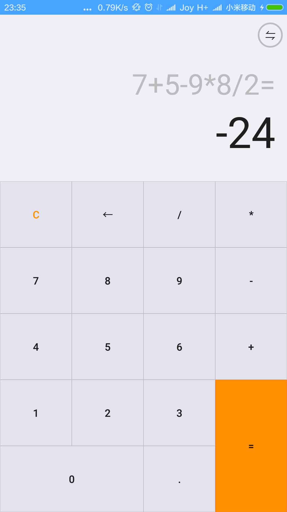
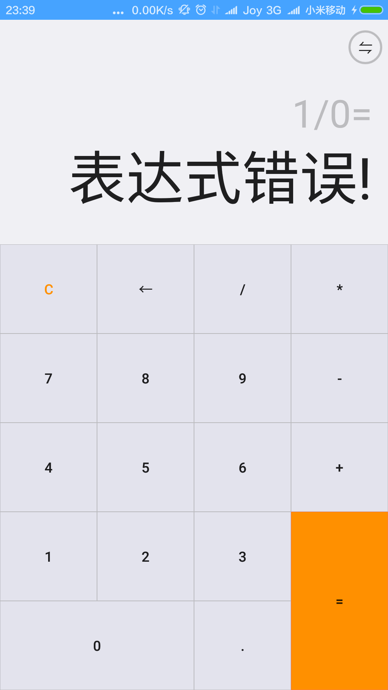
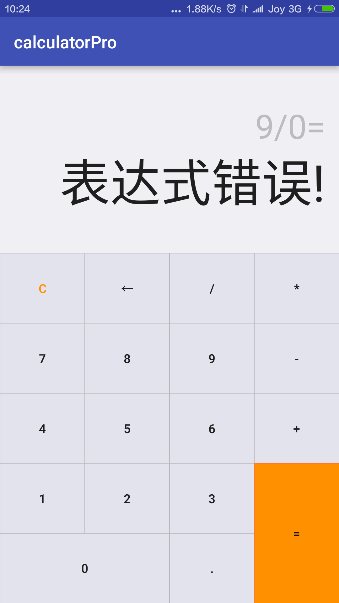

仿MIUI计算器
===========

基本功能：

	1，完成了基本的加减乘除运算。
	2，表达式出错（例如除以0）会返回错误。
	3，点击等号后会有运算小动画（视图动画）。
	4，点击等号运算结束后，再点击运算符和数字会有不同的效果，即点击运算符会把上一次的结果当做第一个数参与运算，而点击数字会清空重新输入。
	
	5，完成科学计算界面
	6，完成简易计算器与科学计算器之间的动画变换。
	7，待完善科学计算的计算程序........囧，还没写完	
	
	
重点：

* 键盘界面仿的小米计算器，使用TableLayout，由于TableLayout不支持合并行，因而采用了嵌套的方式来显示跨行的等号。
* 最上面的表达式和结果显示的两个EditText使用右对齐，注意在每次输入的时候都要setSelection，即：`text2.setSelection(expression.length());`来确保始终会显示最新输入的字符。 
* 为了使简易计算器和科学计算器之间变换效果接近小米原来的效果，这里使用了FrameLayout，键盘在第一层，占据下面2/3的用户区域，其他在第二层占据上面1/3的用户区域。这样，在键盘进行缩放动画的时候就不会影响到第二层的显示。（**键盘的动画始终显示在下面2/3的范围内！！！！**）

另外，注意三种高度的不同：

* 屏幕区域，高度为整个屏幕的高度
* 应用区域，高度为去除状态栏的屏幕的高度
* 用户区域，高度为去除状态栏和标题栏的高度

 
            

