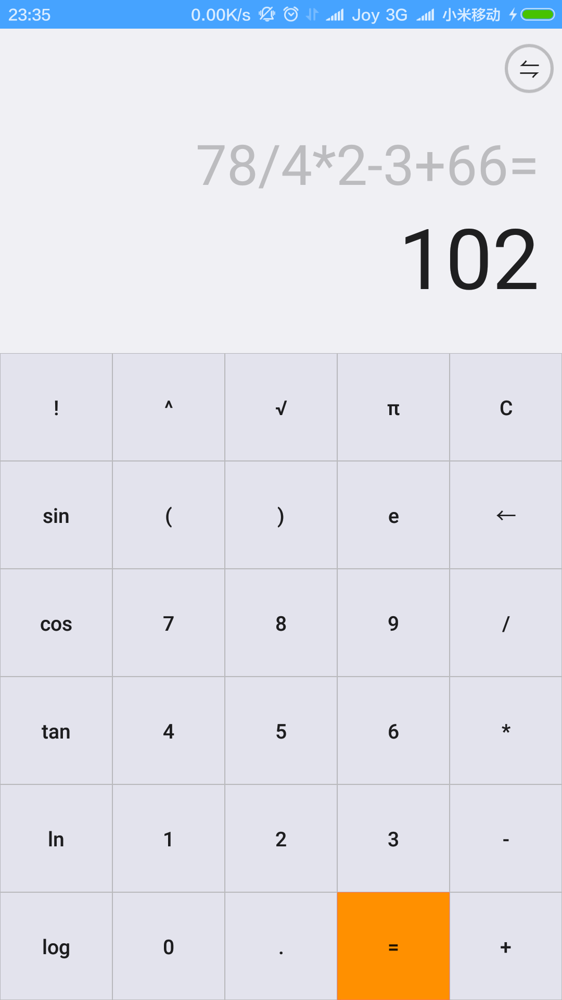

仿MIUI计算器
===========

基本功能：

	1，完成了基本的加减乘除运算。
	2，表达式出错（例如除以0）会返回错误。
	3，点击等号后会有运算小动画（视图动画）。
	4，点击等号运算结束后，再点击运算符和数字会有不同的效果，即点击运算符会把上一次的结果当做第一个数参与运算，而点击数字会清空重新输入。
	5，...
	
	
其他：

* 键盘界面仿的小米计算器，使用GridLayout，由于此布局的某些属性要在android 5.0之后才有，所以使用了v7包。
* 最上面的表达式和结果显示的两个EditText使用右对齐，注意在每次输入的时候都要setSelection，即：`text2.setSelection(expression.length());`来确保始终会显示最新输入的字符。 

_

      
      

